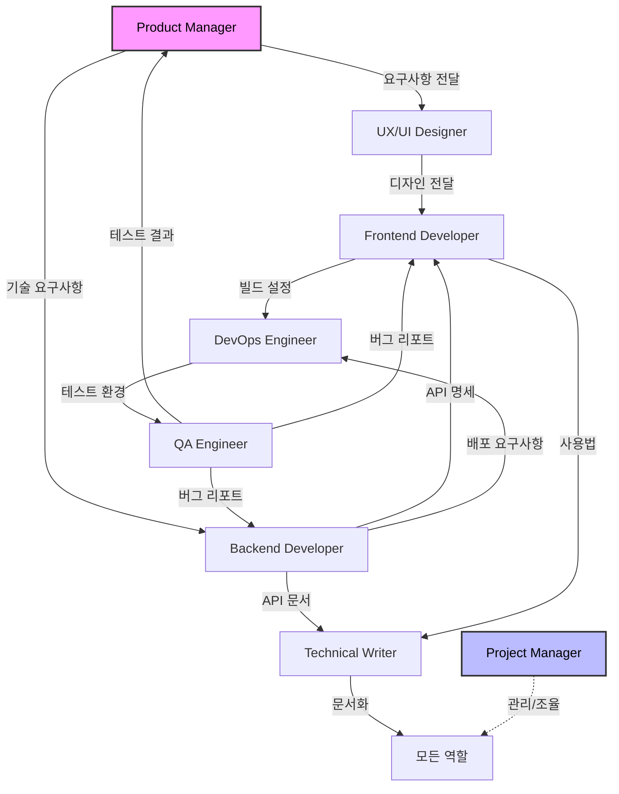
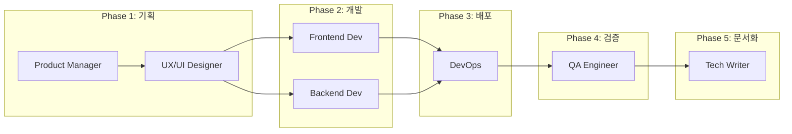

# RP(Role-Playing) 자동화 시스템

AI 에이전트가 특정 역할을 수행할 수 있도록 설계된 프롬프트 템플릿 모음입니다.

## 📋 프로젝트 개요

이 프로젝트는 다양한 IT 분야의 전문가 역할을 AI가 수행할 수 있도록 구조화된 프롬프트 템플릿을 제공합니다. 각 템플릿은 해당 역할의 전문성, 업무 프로세스, 의사소통 방식을 반영하여 설계되었습니다.

## 🎭 제공되는 역할

- **Product Manager** - 제품 전략 및 로드맵 관리자
- **UX/UI Designer** - 사용자 경험 및 인터페이스 디자이너
- **Backend Developer** - 서버 개발 및 API 설계 전문가
- **Frontend Developer** - 사용자 인터페이스 개발 전문가
- **DevOps Engineer** - 인프라 자동화 및 배포 전문가
- **QA Engineer** - 품질 보증 및 테스트 전문가
- **Technical Writer** - 기술 문서 작성 전문가
- **Project Manager** - 프로젝트 일정 및 리소스 관리자

## 🔄 역할 관계 및 워크플로우

### 역할 관계도


### 역할 체인 (순차적 작업 흐름)


### 역할별 협업 매트릭스
| 역할 | Product Manager | UX/UI Designer | Frontend Dev | Backend Dev | DevOps | QA Engineer | Tech Writer | Project Manager |
|------|----------------|----------------|--------------|-------------|---------|-------------|-------------|----------------|
| **Product Manager** | - | 요구사항 전달 | 기능 설명 | 기술 요구사항 | 배포 전략 | 품질 기준 | 문서 요구사항 | 일정 협의 |
| **UX/UI Designer** | 피드백 수신 | - | 디자인 전달 | API 요구사항 | - | 사용성 테스트 | UI 가이드 | 일정 보고 |
| **Frontend Dev** | 기능 확인 | 디자인 구현 | - | API 통합 | 빌드 설정 | 버그 수정 | 사용법 제공 | 진행 상황 |
| **Backend Dev** | 기능 확인 | - | API 제공 | - | 인프라 요구 | 버그 수정 | API 문서 | 진행 상황 |
| **DevOps** | - | - | 배포 지원 | 배포 지원 | - | 환경 제공 | 인프라 문서 | 리소스 요청 |
| **QA Engineer** | 테스트 결과 | UI 버그 | 프론트 버그 | 백엔드 버그 | 환경 이슈 | - | 테스트 문서 | 품질 보고 |
| **Tech Writer** | 문서 검토 | 디자인 문서 | 가이드 작성 | API 문서 | 배포 문서 | 테스트 문서 | - | 문서 일정 |
| **Project Manager** | 전체 조율 | 일정 관리 | 일정 관리 | 일정 관리 | 리소스 관리 | 일정 관리 | 일정 관리 | - |

## 🚀 다른 프로젝트에 적용하는 방법

### 1. 🎯 자동 설치 스크립트 사용 (권장)

가장 쉽고 빠른 방법입니다:

```bash
# 프로젝트 디렉토리로 이동
cd your-project

# 스크립트 다운로드 및 실행
curl -fsSL https://raw.githubusercontent.com/jung-wan-kim/rp-automation/master/init-rp.sh -o init-rp.sh
chmod +x init-rp.sh
./init-rp.sh

# 또는 한 줄로 실행
curl -fsSL https://raw.githubusercontent.com/jung-wan-kim/rp-automation/master/init-rp.sh | bash
```

스크립트는 다음을 수행합니다:
- 전체 RP 적용 또는 필요한 RP만 선택
- `.rp/` 디렉토리에 자동으로 파일 복사
- `.gitignore` 자동 업데이트
- 사용 가이드 자동 생성

### 2. 수동 설치

특정 역할의 프롬프트를 직접 복사하려면:

```bash
# 원하는 역할의 프롬프트 파일을 복사
cp backend-developer.md /path/to/your/project/prompts/

# 또는 직접 내용을 복사하여 AI 도구에 입력
cat backend-developer.md | pbcopy  # macOS
cat backend-developer.md | xclip   # Linux
```

### 3. Git Clone 방식

전체 RP 시스템을 프로젝트에 통합하려면:

```bash
# 이 저장소를 클론
git clone https://github.com/jung-wan-kim/rp-automation.git

# 프로젝트에 prompts 디렉토리 생성
mkdir -p /path/to/your/project/prompts

# 모든 프롬프트 파일 복사
cp rp-automation/*.md /path/to/your/project/prompts/
```

### 4. SYSTEM 프롬프트 활용

`SYSTEM.md`를 사용하여 다중 역할 시스템 구축:

```python
# Python 예시
with open('SYSTEM.md', 'r') as f:
    system_prompt = f.read()

# AI API에 시스템 프롬프트로 설정
response = ai_client.chat(
    system_message=system_prompt,
    user_message="백엔드 개발자로서 REST API를 설계해주세요."
)
```

### 5. 커스터마이징

각 프롬프트는 다음과 같이 구성되어 있어 쉽게 수정 가능합니다:

- **역할 정의**: 전문성과 경력 설정
- **핵심 가치**: 해당 역할의 우선순위
- **소프트 스킬**: 커뮤니케이션 스타일
- **응답 구조**: 표준화된 출력 형식

예시:
```markdown
# 역할 정의 수정
당신은 15년 경력의 시니어 백엔드 개발자입니다.
→ 당신은 5년 경력의 주니어 백엔드 개발자입니다.

# 기술 스택 변경
- 주요 기술: Node.js, Python, Java
→ - 주요 기술: Go, Rust, C++
```

## 📁 파일 구조

```
rp-automation/
├── README.md                 # 이 파일
├── INSTALL.md               # 설치 가이드
├── init-rp.sh               # 자동 설치 스크립트
├── SYSTEM.md                # 전체 시스템 프롬프트
├── backend-developer.md     # 백엔드 개발자 프롬프트
├── frontend-developer.md    # 프론트엔드 개발자 프롬프트
├── devops-engineer.md       # DevOps 엔지니어 프롬프트
├── product-manager.md       # 제품 관리자 프롬프트
├── project-manager.md       # 프로젝트 관리자 프롬프트
├── qa-engineer.md           # QA 엔지니어 프롬프트
├── technical-writer.md      # 기술 문서 작성자 프롬프트
├── ux-ui-designer.md        # UX/UI 디자이너 프롬프트
└── RP_작업_결과_요약.md       # 각 RP별 작업 내용 요약
```

## 💡 활용 예시

### 1. Claude Code에서 사용하기
```bash
# 특정 RP로 작업 시작
claude-code ".rp/backend-developer.md를 참고해서 API를 설계해줘"

# 여러 RP 협업
claude-code ".rp/ 디렉토리의 모든 RP를 활용해서 프로젝트를 진행해줘"
```

### 2. Claude Projects
```
1. Claude에서 새 프로젝트 생성
2. Project instructions에 SYSTEM.md 내용 입력
3. 대화 시작 시 원하는 역할 지정
```

### 3. 프로젝트별 커스텀 프롬프트
```bash
# 프로젝트 특화 프롬프트 추가
echo "프로젝트별 추가 지시사항" > .rp/PROJECT_CONTEXT.md

# Claude Code에서 프로젝트 컨텍스트와 함께 사용
claude-code ".rp/PROJECT_CONTEXT.md와 .rp/backend-developer.md를 참고해서 작업해줘"
```

## 🔧 고급 활용

### 팀 시뮬레이션
여러 역할을 동시에 활용하여 가상의 개발팀 구성:

```bash
# Claude Code에서 팀 시뮬레이션
claude-code "Product Manager로 시작해서 모든 RP를 순차적으로 활용해
            새로운 기능에 대한 개발 프로세스를 진행해줘"
```

### 실제 활용 시나리오

#### 시나리오 1: 새로운 기능 개발
```bash
# 1단계: Product Manager로 요구사항 정의
claude-code ".rp/product-manager.md를 참고해서 
            사용자 프로필 기능의 PRD를 작성해줘"

# 2단계: UX/UI Designer로 디자인
claude-code "이전에 작성한 PRD를 바탕으로 
            .rp/ux-ui-designer.md를 참고해서 UI를 디자인해줘"

# 3단계: 개발팀 동시 작업
claude-code ".rp/backend-developer.md와 .rp/frontend-developer.md를 
            동시에 활용해서 API와 UI를 개발해줘"

# 4단계: DevOps로 배포 준비
claude-code ".rp/devops-engineer.md를 참고해서 
            개발된 기능을 배포 준비해줘"

# 5단계: QA로 테스트
claude-code ".rp/qa-engineer.md를 참고해서 
            전체 기능을 테스트해줘"
```

#### 시나리오 2: 버그 수정 프로세스
```bash
# QA가 버그 발견 → 개발자가 수정 → DevOps가 핫픽스 배포
claude-code "QA Engineer 역할로 버그를 분석하고,
            Backend/Frontend Developer로 수정한 뒤,
            DevOps Engineer로 핫픽스를 배포해줘"
```

#### 시나리오 3: 전체 프로젝트 시뮬레이션
```bash
# 모든 역할을 순차적으로 활용한 풀 사이클 개발
claude-code ".rp/PROJECT_CONTEXT.md와 함께 모든 RP를 활용해서
            '온라인 쇼핑몰' 프로젝트를 처음부터 끝까지 진행해줘"
```

## 📝 라이선스

이 프로젝트는 자유롭게 사용, 수정, 배포할 수 있습니다. 상업적 이용도 가능합니다.

## 🤝 기여하기

새로운 역할이나 개선사항이 있다면 PR을 보내주세요!

1. Fork the repository
2. Create your feature branch (`git checkout -b feature/new-role`)
3. Commit your changes (`git commit -m 'Add new role: Data Scientist'`)
4. Push to the branch (`git push origin feature/new-role`)
5. Open a Pull Request