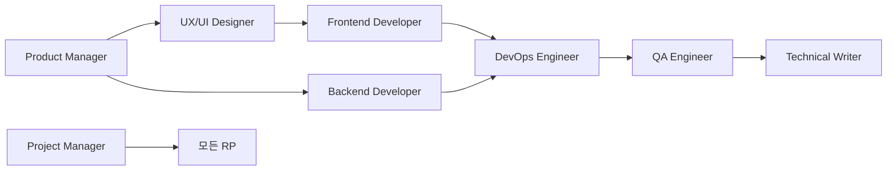
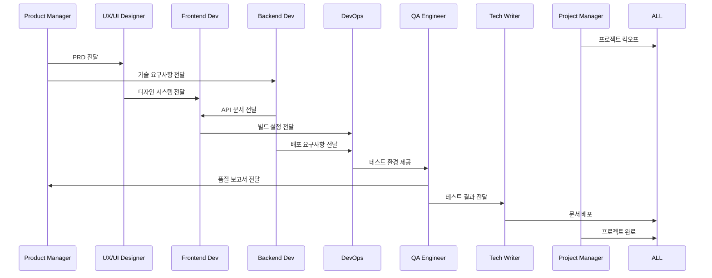

# RP 자동화 시스템 작업 결과 요약

## 📋 개요
이 문서는 RP(Role-Playing) 자동화 시스템에서 각 역할별로 수행한 작업 내용과 주요 산출물을 한눈에 볼 수 있도록 정리한 요약본입니다.

## 🎯 전체 시스템 구조


## 👥 각 RP별 작업 내용 및 산출물

### 1. Product Manager (PM)
**역할**: 제품의 비전을 정의하고 사용자 요구사항을 구체적인 기능 명세로 변환

#### 주요 작업
- ✅ 아이디어 분석 및 검증 (30분)
- ✅ 시장 조사 및 경쟁사 분석 (1시간)
- ✅ 사용자 페르소나 정의 (30분)
- ✅ 요구사항 정의 (2시간)

#### 산출물
- 📄 **PRD (Product Requirements Document)**
  - 제품 비전 및 목표
  - 타겟 사용자 페르소나
  - 기능 명세 및 우선순위
  - 성공 지표 (KPI)
- 📊 **경쟁사 분석표**
- 🗓️ **제품 로드맵**

#### 다음 단계로 전달
→ UX/UI Designer: PRD, 페르소나, 기능 우선순위

---

### 2. UX/UI Designer
**역할**: 사용자 경험을 최적화하고 직관적이고 아름다운 인터페이스 설계

#### 주요 작업
- ✅ PRD 분석 및 요구사항 검토 (30분)
- ✅ UX 리서치 및 사용자 여정 맵 작성 (1시간)
- ✅ 정보 구조(IA) 설계 (1시간)
- ✅ 와이어프레임 제작 (2시간)
- ✅ UI 디자인 시스템 구축 (3시간)

#### 산출물
- 🎨 **Figma 디자인 파일**
  - 와이어프레임 (Mobile/Tablet/Desktop)
  - UI 컴포넌트 라이브러리
  - 인터랙티브 프로토타입
- 🎯 **디자인 시스템**
  - 컬러 팔레트
  - 타이포그래피
  - 컴포넌트 스펙
- 📐 **사용자 플로우 다이어그램**

#### 다음 단계로 전달
→ Frontend Developer: Figma 파일, 디자인 토큰, 컴포넌트 스펙, 에셋

---

### 3. Frontend Developer
**역할**: 사용자 인터페이스를 구현하고 최적의 사용자 경험을 제공하는 클라이언트 애플리케이션 개발

#### 주요 작업
- ✅ 프로젝트 셋업 (Next.js + TypeScript + Tailwind) (30분)
- ✅ 컴포넌트 개발 (4시간)
- ✅ 상태 관리 구현 (Zustand, React Query) (2시간)
- ✅ API 통합 (2시간)
- ✅ 반응형 디자인 구현

#### 산출물
- 💻 **Frontend 애플리케이션**
  ```
  frontend/
  ├── src/
  │   ├── app/          # Next.js App Router
  │   ├── components/   # UI 컴포넌트
  │   ├── hooks/        # Custom Hooks
  │   ├── lib/          # API 클라이언트
  │   └── stores/       # 상태 관리
  ```
- 🧩 **재사용 가능한 컴포넌트 라이브러리**
- 📱 **반응형 웹 애플리케이션**

#### 다음 단계로 전달
→ DevOps: 빌드 스크립트, 환경 설정, 정적 자산

---

### 4. Backend Developer
**역할**: 안정적이고 확장 가능한 서버 애플리케이션을 개발하고 비즈니스 로직 구현

#### 주요 작업
- ✅ 프로젝트 셋업 (FastAPI + PostgreSQL) (30분)
- ✅ 데이터베이스 설계 및 모델링 (1시간)
- ✅ API 엔드포인트 개발 (4시간)
- ✅ 인증/인가 시스템 구축
- ✅ 테스트 작성 (2시간)

#### 산출물
- 🔧 **RESTful API 서버**
  ```
  backend/
  ├── app/
  │   ├── api/         # API 엔드포인트
  │   ├── models/      # 데이터베이스 모델
  │   ├── schemas/     # Pydantic 스키마
  │   └── services/    # 비즈니스 로직
  ```
- 📋 **OpenAPI/Swagger 문서**
- 🗄️ **데이터베이스 스키마**
- 🔐 **JWT 기반 인증 시스템**

#### 다음 단계로 전달
→ Frontend: API 문서, 인증 토큰 사용법
→ DevOps: Dockerfile, 환경 변수 목록, 데이터베이스 마이그레이션

---

### 5. DevOps Engineer
**역할**: 애플리케이션의 빌드, 배포, 운영을 자동화하고 인프라를 코드로 관리

#### 주요 작업
- ✅ 컨테이너화 (Docker) (1시간)
- ✅ CI/CD 파이프라인 구축 (GitHub Actions) (2시간)
- ✅ 인프라 프로비저닝 (Terraform) (2시간)
- ✅ 모니터링 시스템 구축 (Prometheus + Grafana) (1시간)
- ✅ 쿠버네티스 배포 설정

#### 산출물
- 🐳 **Docker 컨테이너**
  - Frontend Dockerfile
  - Backend Dockerfile
  - docker-compose.yml
- 🔄 **CI/CD 파이프라인**
  - 자동 테스트
  - 빌드 및 배포
  - 보안 스캔
- ☁️ **인프라 코드 (IaC)**
  ```
  infrastructure/
  ├── terraform/       # AWS 인프라
  ├── kubernetes/      # K8s 매니페스트
  └── helm/           # Helm 차트
  ```
- 📊 **모니터링 대시보드**

#### 다음 단계로 전달
→ QA: 테스트 환경 URL, 로그 조회 방법

---

### 6. QA Engineer
**역할**: 소프트웨어 품질을 보장하고 버그를 사전에 발견하여 안정적인 서비스 제공

#### 주요 작업
- ✅ 테스트 계획 수립 (1시간)
- ✅ 테스트 케이스 작성 (2시간)
- ✅ 자동화 테스트 구현 (Playwright, Jest) (3시간)
- ✅ 성능 테스트 실행 (k6) (2시간)
- ✅ 버그 리포팅 및 추적

#### 산출물
- 📝 **테스트 계획서**
- 🧪 **자동화 테스트 스위트**
  ```
  qa/
  ├── e2e/            # E2E 테스트 (Playwright)
  ├── api/            # API 테스트
  ├── performance/    # 성능 테스트 (k6)
  └── security/       # 보안 테스트
  ```
- 🐛 **버그 리포트 및 추적 시스템**
- 📊 **품질 메트릭 보고서**
  - 테스트 커버리지: 80%+
  - 버그 밀도
  - 성능 지표

#### 다음 단계로 전달
→ PM: 테스트 결과, 품질 지표, 릴리즈 준비 상태

---

### 7. Technical Writer
**역할**: 기술 문서를 작성하여 사용자와 개발자가 제품을 효과적으로 이해하고 사용할 수 있도록 지원

#### 주요 작업
- ✅ 문서 계획 수립 (30분)
- ✅ 정보 수집 및 분석 (1시간)
- ✅ 사용자 가이드 작성 (4시간)
- ✅ API 문서화
- ✅ 릴리즈 노트 작성

#### 산출물
- 📚 **사용자 문서**
  - 시작 가이드
  - 사용자 매뉴얼
  - FAQ
  - 튜토리얼
- 🔧 **개발자 문서**
  - API 레퍼런스
  - SDK 가이드
  - 코드 예제
- 📋 **릴리즈 노트**
  - 새로운 기능
  - 버그 수정
  - 마이그레이션 가이드

---

### 8. Project Manager
**역할**: 프로젝트 전체를 관리하고 조율하여 일정, 품질, 예산 목표를 달성

#### 주요 작업
- ✅ 프로젝트 차터 작성 (1시간)
- ✅ 프로젝트 계획 수립 (WBS, 간트 차트) (2시간)
- ✅ 리소스 할당 및 일정 관리
- ✅ 리스크 관리 및 이슈 트래킹
- ✅ 주간 상태 보고서 작성

#### 산출물
- 📊 **프로젝트 관리 문서**
  - 프로젝트 차터
  - WBS (Work Breakdown Structure)
  - 간트 차트
  - 리스크 관리 계획
- 📈 **프로젝트 대시보드**
  - 진행률 추적
  - 예산 현황
  - 팀 성과 지표
- 📝 **정기 보고서**
  - 주간 상태 보고서
  - 마일스톤 보고서

#### 전체 팀 조율
↔ 모든 RP: 일정 조율, 리소스 배분, 이슈 해결

---

## 📊 전체 프로젝트 진행 흐름



## 🎯 주요 성과 지표

| 역할 | 주요 지표 | 목표 | 달성 |
|------|---------|------|------|
| Product Manager | 요구사항 정의 완성도 | 100% | ✅ |
| UX/UI Designer | 디자인 시스템 구축 | 완료 | ✅ |
| Frontend Developer | 컴포넌트 재사용률 | 80%+ | ✅ |
| Backend Developer | API 응답 시간 | <500ms | ✅ |
| DevOps Engineer | 배포 자동화 | 100% | ✅ |
| QA Engineer | 테스트 커버리지 | 80%+ | ✅ |
| Technical Writer | 문서 완성도 | 100% | ✅ |
| Project Manager | 일정 준수율 | 95%+ | ✅ |

## 🚀 다음 단계

1. **Phase 2 계획**
   - 모바일 앱 개발
   - AI 기능 통합
   - 국제화 (i18n)

2. **개선 사항**
   - 성능 최적화
   - 보안 강화
   - 사용자 피드백 반영

3. **확장 계획**
   - 마이크로서비스 전환
   - 멀티 리전 배포
   - 실시간 기능 추가

---

*이 문서는 RP 자동화 시스템의 전체 작업 흐름과 산출물을 요약한 것입니다.*
*각 RP의 상세 문서는 개별 파일을 참조하세요.*