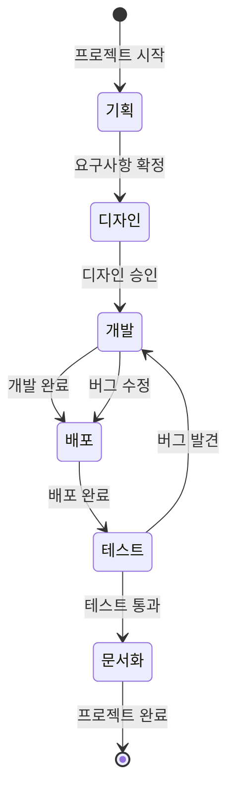
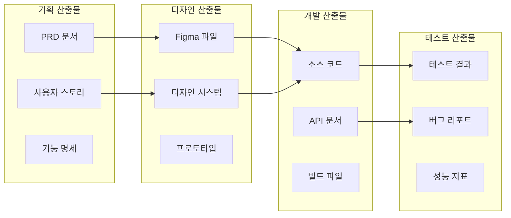

# RP 워크플로우 가이드

## 🎯 개요
이 문서는 RP(Role-Playing) 시스템의 역할별 관계와 협업 방식을 상세히 설명합니다.

## 🔄 표준 개발 워크플로우

### 1️⃣ 전체 개발 사이클


### 2️⃣ 역할별 주요 책임

#### Phase 1: 기획 단계
- **Project Manager**: 프로젝트 초기화, 일정 수립
- **Product Manager**: 요구사항 정의, PRD 작성
- **UX/UI Designer**: 사용자 리서치, 와이어프레임

#### Phase 2: 개발 단계
- **Backend Developer**: API 설계 및 구현
- **Frontend Developer**: UI 구현 및 통합
- **DevOps Engineer**: 개발 환경 구축

#### Phase 3: 검증 단계
- **QA Engineer**: 테스트 계획 및 실행
- **Technical Writer**: 문서 작성
- **Project Manager**: 진행 상황 모니터링

## 📊 역할 간 데이터 흐름

### 주요 산출물 전달 체계


## 🤝 역할별 협업 패턴

### Pattern 1: 순차적 협업 (Waterfall)
```
PM → UX/UI → Frontend → Backend → DevOps → QA → TW
```
**적합한 경우**: 명확한 요구사항, 충분한 시간

### Pattern 2: 병렬 협업 (Agile)
```
PM → UX/UI
     ↘
       Frontend ← Backend
              ↘  ↙
              DevOps
                ↓
                QA
```
**적합한 경우**: 빠른 개발, 반복적 개선

### Pattern 3: 페어 협업
```
Frontend ↔ Backend (API 통합)
DevOps ↔ Backend (인프라 요구사항)
QA ↔ Frontend/Backend (버그 수정)
```
**적합한 경우**: 복잡한 통합 작업

## 💬 커뮤니케이션 프로토콜

### 정보 전달 표준
```yaml
From: [발신 역할]
To: [수신 역할]
Type: [요청/정보/피드백/승인]
Priority: [High/Medium/Low]
Content:
  - 주요 내용
  - 필요한 조치
  - 기한
Attachments:
  - 관련 문서
  - 참고 자료
```

### 역할별 주요 커뮤니케이션
| 발신자 | 수신자 | 주요 내용 | 빈도 |
|--------|--------|-----------|------|
| PM | UX/UI | 요구사항, 사용자 피드백 | 일일 |
| UX/UI | Frontend | 디자인 업데이트, 인터랙션 가이드 | 주 2-3회 |
| Backend | Frontend | API 변경사항, 엔드포인트 추가 | 수시 |
| Frontend | Backend | API 요청사항, 데이터 구조 논의 | 수시 |
| DevOps | All | 배포 일정, 환경 변경사항 | 주간 |
| QA | Dev Team | 버그 리포트, 테스트 결과 | 일일 |
| TW | All | 문서 업데이트, 정보 요청 | 주간 |
| PjM | All | 일정 변경, 리소스 조정 | 수시 |

## 🚨 이슈 에스컬레이션 체계

### Level 1: 팀 내 해결
```
개발자 간 기술적 이슈 → 시니어 개발자
디자인 이슈 → UX/UI 리드
```

### Level 2: 역할 간 조율
```
API 스펙 불일치 → Backend + Frontend 미팅
성능 요구사항 → DevOps + Backend 협의
```

### Level 3: 매니저 개입
```
일정 충돌 → Project Manager
요구사항 변경 → Product Manager
```

### Level 4: 스테이크홀더 결정
```
주요 방향성 변경 → PM + PjM → 경영진
```

## 📈 성과 측정 지표

### 역할별 KPI
| 역할 | 주요 지표 | 목표 |
|------|----------|------|
| Product Manager | 요구사항 명확성 | 90% |
| UX/UI Designer | 디자인 승인율 | 첫 제출 80% |
| Frontend Developer | UI 버그 발생률 | < 5% |
| Backend Developer | API 응답시간 | < 200ms |
| DevOps Engineer | 배포 성공률 | > 95% |
| QA Engineer | 버그 발견율 | > 85% |
| Technical Writer | 문서 완성도 | 100% |
| Project Manager | 일정 준수율 | > 90% |

## 🔧 도구 및 플랫폼

### 역할별 주요 도구
- **PM**: Jira, Notion, Confluence
- **UX/UI**: Figma, Sketch, Adobe XD
- **Frontend**: VS Code, Chrome DevTools, React DevTools
- **Backend**: Postman, DataGrip, pgAdmin
- **DevOps**: Jenkins, Docker, Kubernetes Dashboard
- **QA**: Selenium, JMeter, TestRail
- **TW**: Markdown, Docusaurus, Swagger
- **PjM**: MS Project, Gantt Chart, Slack

## 💡 베스트 프랙티스

### 1. 일일 스탠드업
```
참여자: 모든 활성 역할
시간: 15분
내용:
- 어제 완료한 작업
- 오늘 할 작업
- 블로커 공유
```

### 2. 주간 리뷰
```
참여자: PM, PjM, 각 팀 리드
시간: 1시간
내용:
- 주간 성과 검토
- 이슈 및 리스크 논의
- 다음 주 계획
```

### 3. 스프린트 회고
```
참여자: 전체 팀
시간: 2시간
내용:
- Keep (잘한 점)
- Problem (문제점)
- Try (시도할 점)
```

## 📚 참고 자료

### 추가 학습 자료
- [Agile 방법론](https://agilemanifesto.org/)
- [DevOps 핸드북](https://itrevolution.com/devops-handbook/)
- [디자인 시스템 가이드](https://www.designsystems.com/)

### 관련 문서
- [RP_작업_결과_요약.md](./RP_작업_결과_요약.md)
- [PROJECT_CONTEXT_TEMPLATE.md](./PROJECT_CONTEXT_TEMPLATE.md)
- [각 역할별 상세 가이드](./)